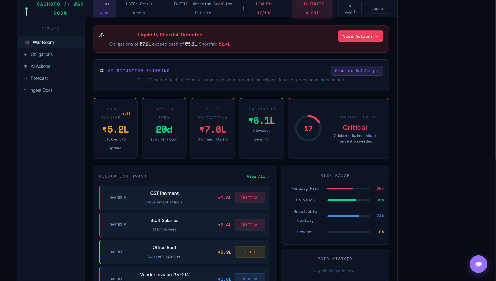
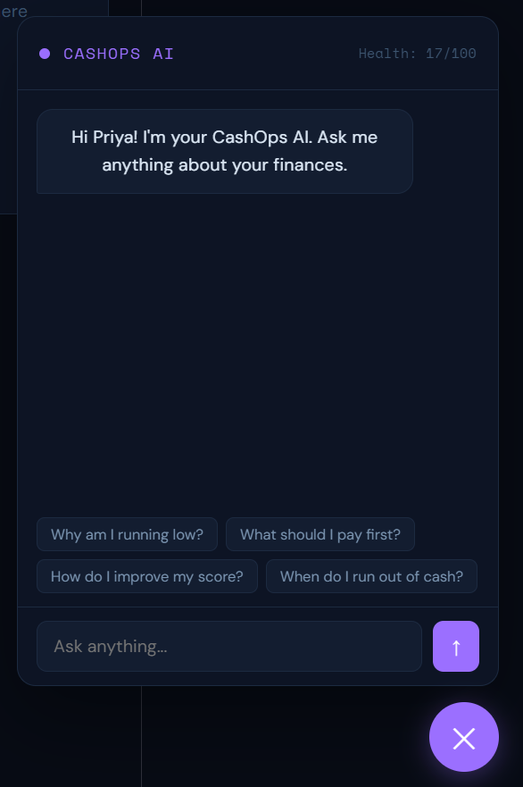
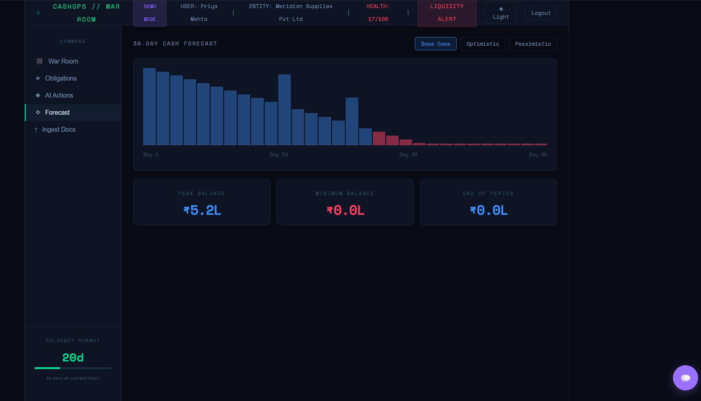
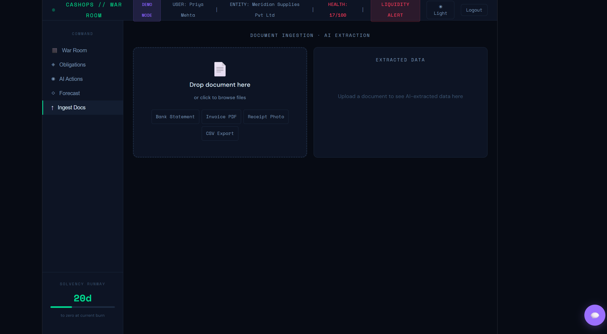
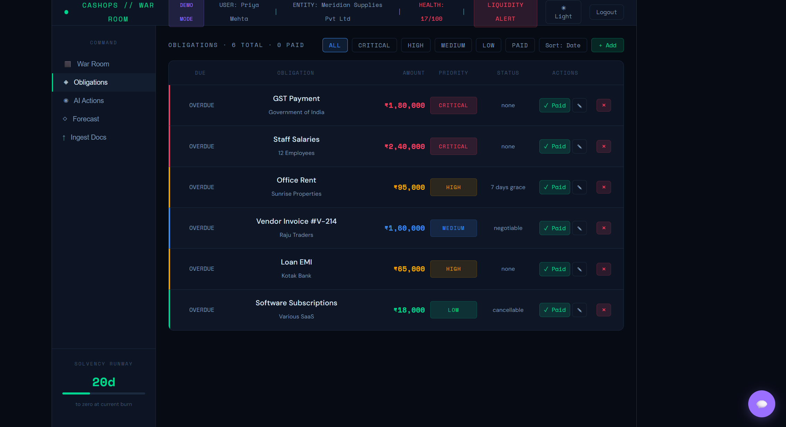
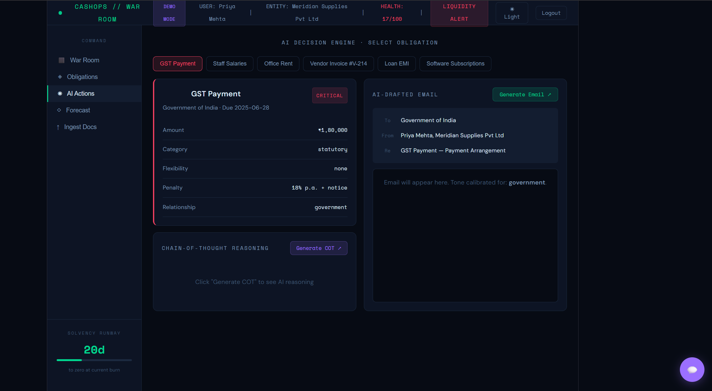

# 💰 CashOps – AI-Powered Financial Decision System

CashOps is a semi-autonomous financial intelligence system designed to help small businesses make **smart, short-term cash flow decisions**.

Instead of just showing data, it **analyzes your financial state and suggests actionable decisions** using AI.

---

## 🚀 Features

### 📊 Financial Dashboard

* Real-time view of:

  * Cash balance
  * Obligations (payables)
  * Receivables
* Visual indicators of financial health

### ⚠️ Constraint & Risk Detection

* Identifies when obligations exceed available cash
* Calculates:

  * Shortfall
  * Runway (days before cash runs out)
  * Liquidity ratio

### 🧠 AI Decision Engine

* Integrated AI chatbot (Gemini API)
* Provides:

  * Payment prioritization
  * Risk explanations
  * Actionable financial advice

### ⚡ What-If Simulator

* Simulate delaying payments
* Instantly see impact on:

  * Cash runway
  * Financial health score

### 📄 Multi-Source Financial Input

* Supports:

  * Invoices
  * Expenses
  * Receivables
  * Manual entries

### 🔐 Authentication System

* Login / Signup system using local storage
* Demo mode with sample data

---

## 🛠 Tech Stack

### Frontend

* React 18
* JavaScript (ES6+)
* CSS-in-JS (inline styling)

### Backend

* Node.js
* Express

### AI / LLM

* Google Gemini API

### State Management

* React Hooks (useState, useEffect, useRef)

### Build Tool

* Vite / Create React App

---

## 🧱 Architecture Overview

```
Frontend (React UI)
        ↓
Backend API (Node.js / Express)
        ↓
Gemini API (AI reasoning)
```

---

## 📸 Screenshots

> Add screenshots here after uploading to GitHub

```


```

---

## ▶️ How to Run Locally

### 1. Clone the repository

```
git clone https://github.com/your-username/your-repo-name.git
cd your-repo-name
```

### 2. Install dependencies

```
npm install
```

### 3. Setup environment variables

Create a `.env` file:

```
GEMINI_API_KEY=your_api_key_here
```

### 4. Run the project

```
npm start
```

---

## 🧪 Demo Mode

* No signup required
* Preloaded financial data
* Explore all features instantly

---

## 📸 Screenshots

### 📊 Dashboard


### 🤖 AI Chatbot


### 📈 Forecast View


### 📥 Data Ingestion


### 📋 Obligations Tracking


### ⚡ AI Actions


## 📌 Use Case

Small businesses often:

* Rely only on current bank balance
* Miss upcoming obligations
* Make reactive decisions

CashOps solves this by:

* Modeling financial state
* Detecting risks early
* Suggesting next best actions

---

## 📈 Future Improvements

* Database integration (MongoDB / PostgreSQL)
* Real bank API integrations
* Advanced forecasting (ML models)
* Multi-user collaboration

---

## 👨‍💻 Author

**R L Nagindhar Sachein**

---

## ⭐ If you like this project

Give it a star ⭐ on GitHub!
